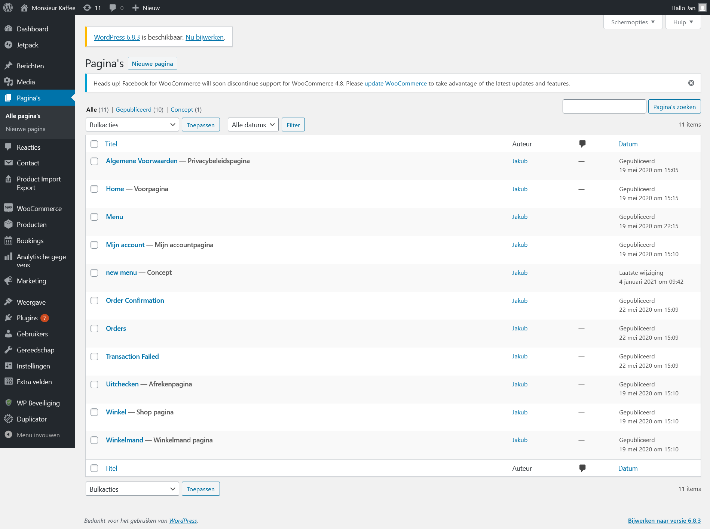
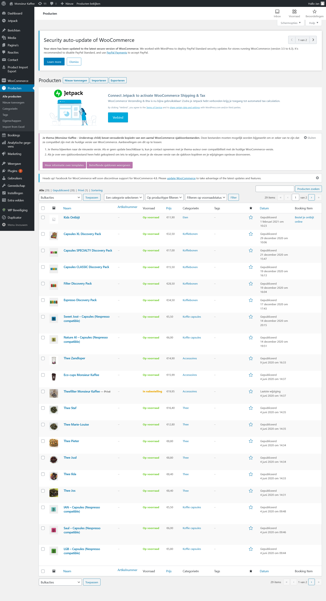
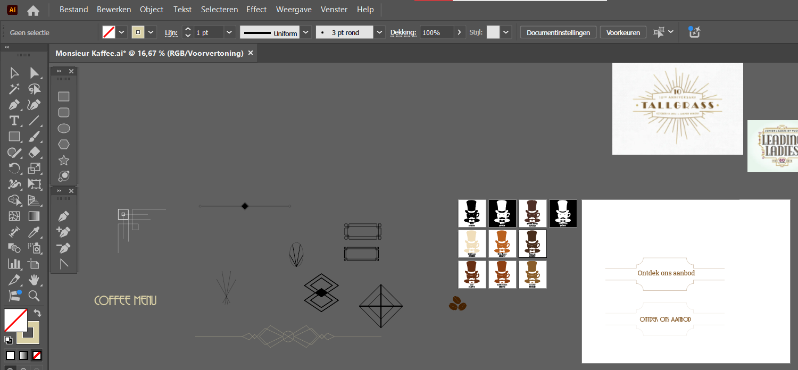
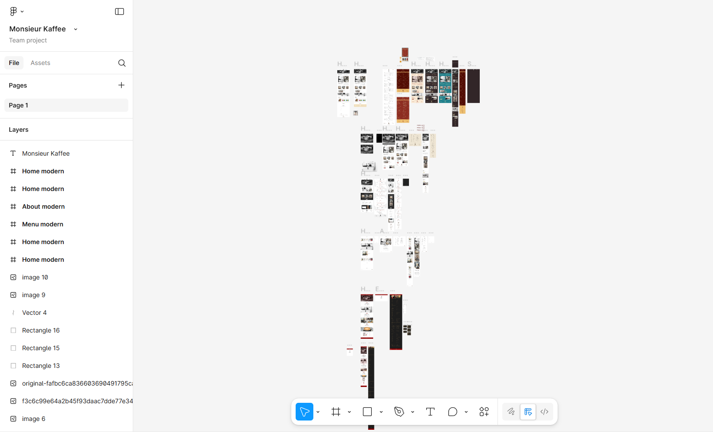
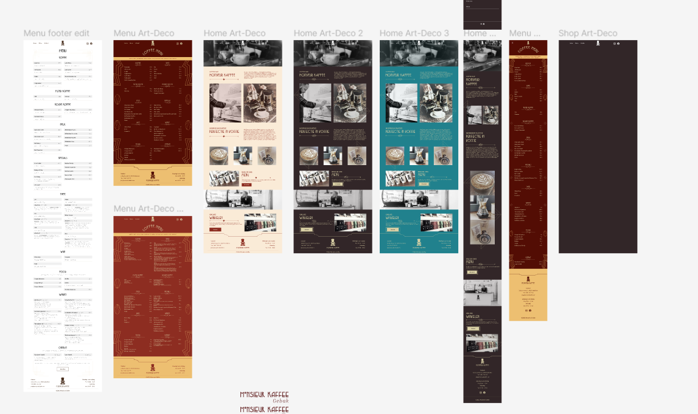
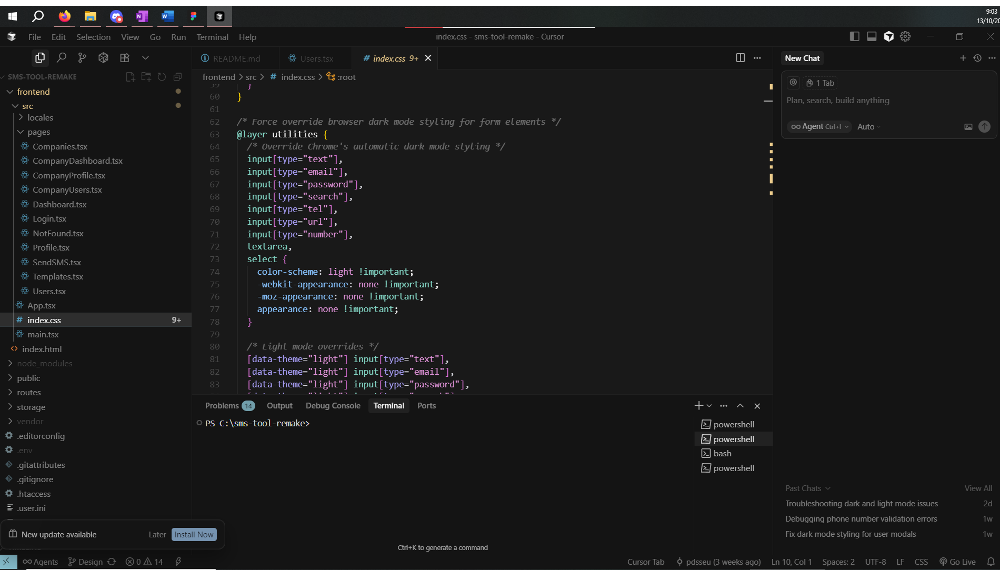
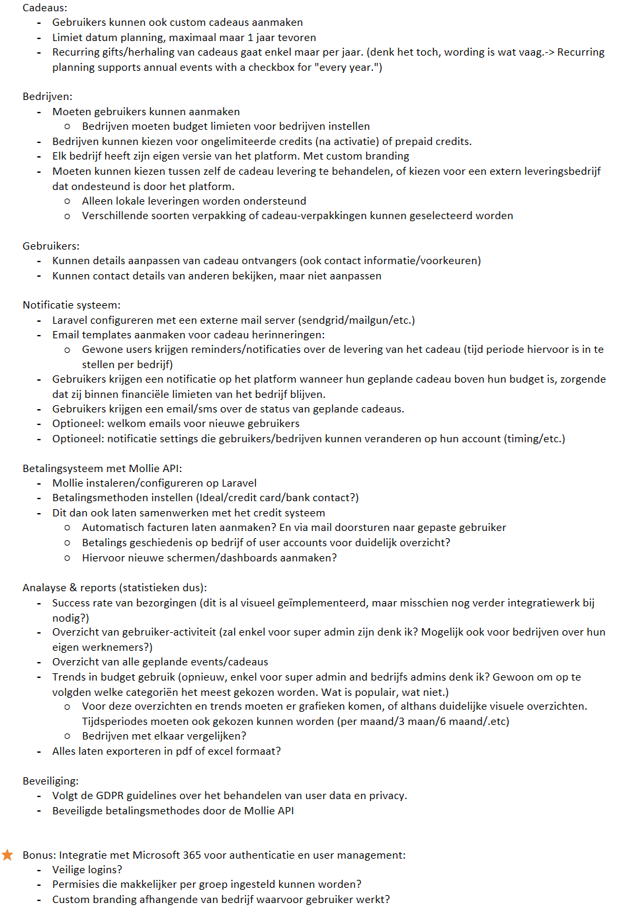
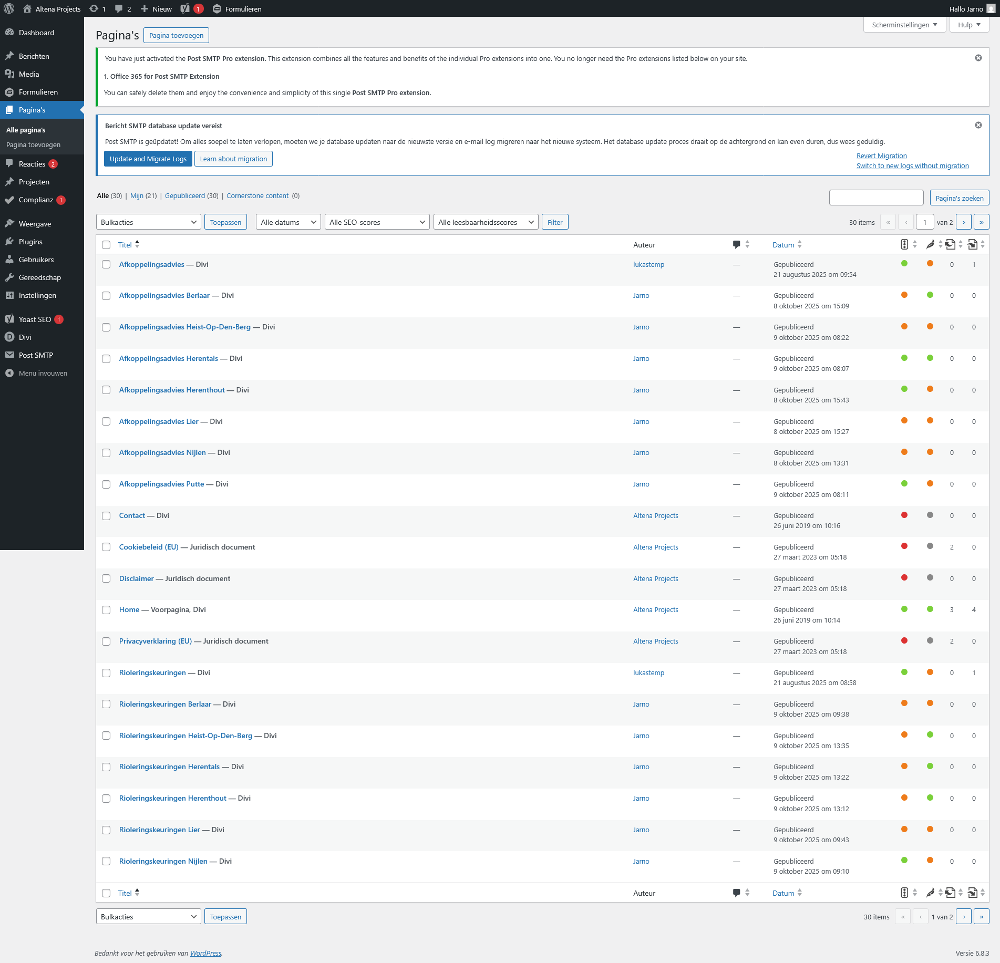
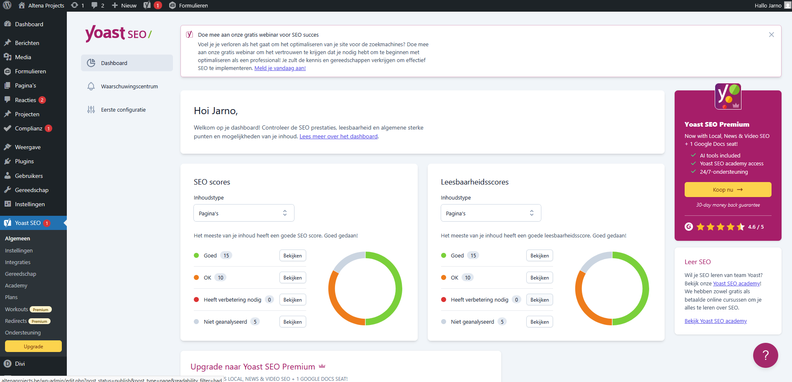

De voorbije weken stonden in het teken van verschillende nieuwe projecten en verdere verdieping in zowel design als technische uitvoering. Een van de hoogtepunten was zonder twijfel het eerste echte klantproject: Monsieur Kaffee. Het gesprek met Jan Vits, eigenaar en barista van Monsieur Kaffee, verliep vlot en aangenaam. We hebben samen besproken wat ik voor hem kon betekenen en hoe zijn website verbeterd kon worden. Hoewel de site op zich nog degelijk oogde, was ze duidelijk wat verouderd — de laatste update dateerde immers van begin 2020.
Tijdens het gesprek kwamen verschillende verbeterpunten naar voren. De prijzen op de menukaart bleken niet meer te kloppen, de online webwinkel werkte niet optimaal en mocht eventueel verwijderd of herzien worden, afhankelijk van hoe ik dit kon aanpassen. Ook op vlak van styling kon de website wel een opfrissing gebruiken. Jan had weinig specifieke eisen: het logo en de algemene branding moesten behouden blijven, maar verder kreeg ik nagenoeg volledige vrijheid om de website naar eigen inzicht te vernieuwen.

De voorbije 2 weken heb ik me dan, wanneer er geen andere taken mijn richting uitkwamen, bezig gehouden met het designprocess in figma. Intussen heb ik al toegang gekregen tot zijn WordPress-omgeving, zodat ik tests en kleine aanpassingen kon uitvoeren. Zo heb ik de prijzen op de menupagina alvast geüpdatet op basis van de huidige gegevens. Verder heb ik deze toegang gebruikt om me wat wegwijs te maken in de back-end omgeving, en alvast vooruit te plannen over hoe ik de uiteindelijk opbouw van de nieuwe website zou uitvoeren. 

Om de structuur en visuele stijl beter te kunnen analyseren, heb ik de volledige website nagebouwd in Figma. Dit laat me toe om vlot aanpassingen te testen en stijlelementen opnieuw te gebruiken. De eerste bewerkingen omvatten bijvoorbeeld een modernere header met een meer open lay-out en een nieuwe footer waarin het logo centraal staat. Het contactformulier en de eenvoudige openingsuren werden vervangen door een meer stijlvolle presentatie, die is opgenomen in de footer zelf. Daarnaast ben ik ook in Illustrator aan de slag gegaan om met de kleuren van het logo te spelen, alsook stijlelementen aan te maken die ik in verdere website designs zou kunnen gebruiken.

Uiteindelijk heb ik een 6-tal designs kunnen maken: één versie die dicht bij de huidige website blijft, een modernere interpretatie met subtiele aanpassingen, en een speelsere variant met koffietinten, ronde afbeeldingen en zachte achtergrondvormen. Verder heb ik ook nog meer exotische veranderingen gemaakt, spelende met flashy kleuren, en uiteindelijk een zeer stijlvolle Roaring 20’s/Art-Deco stijl. Elke variant werd natuurlijk gepaard met een mobiele versie zodat het ontwerp al volledig responsive kon uitgepland worden. Om mijn designs in details te bekijken kan je mijn figma file bezoeken: https://www.figma.com/design/FUaJl4y4Q2OCwEi9BEOsXr/Monsieur-Kaffee?node-id=0-1&t=hMrtpXXpPAuO4oij-1

Tijdens een follow up gesprek koos Jan uiteindelijk voor de art-deco stijl, wat goed past bij het karakter van de koffiebar en het lettertype dat momenteel al in gebruik was. We bespraken daarbij ook enkele praktische zaken zoals het behoud van de webshop via WooCommerce en de mogelijke overgang van zijn WordPress-omgeving naar het systeem van PDSS, zodat verdere aanpassingen in Divi eenvoudiger worden.

Parallel aan dit klantproject werkte ik verder aan de SMS-tool die Rob eerder had opgestart. Hier heb ik nog enkele front-end verbeteringen doorgevoerd, waaronder de vertalingen van ontbrekende teksten, stylingaanpassingen aan invoervelden en modals (pop-up schermen voor het aanpassen en verwijderen van data), en het optimaliseren van de dark/light modes. Deze hebben we dan uiteindelijk in een demo aan Lukas getoont, en na positieve feedback is rob begonnen met de service te deployen. Ook het inlogscherm kreeg nog een laatste update om de gebruikservaring te verbeteren. Ten slotte, voor de smstool volledig in productie ging, heb ik snel nog een aantal laatste design problemen opgelost omtrent de light&dark mode en de manier waarop webbrowsers interne stijl thema’s toepassen. Dit was een simpele fix met een aantal css verandering en overal waar nodig de ‘!important’ tag aan toe te voegen, zodat browser thema’s geen design keuzes konden doorpushen wanneer niet nodig/gewenst. Daarmee is dit project voorlopig afgerond, al kunnen er later nog aanpassingen volgen afhankelijk van verdere feedback.

Daarnaast kreeg ik de kans om Rob te ondersteunen bij zijn nieuwe opdracht: het ontwerpen van het Gift Portal. Dit platform moet PDSS toelaten om klantrelaties te beheren en geschenken te versturen of bij te houden via een online systeem. Ik hielp mee aan de visuele opzet en structuur van het platform en dacht mee over de hiërarchie en ontbrekende functionaliteiten. Hierbij kwamen onder meer features aan bod zoals budgetlimieten per bedrijf, een ingebouwd betalingssysteem via Mollie, een notificatiesysteem met e-mailherinneringen (beheerd via sendgrid), en een dashboard met rapportages en statistieken. Deze opdracht bestond langs mijn kant voornamelijk over planning en projectmanagement, het opstellen van een lijst aan to-do’s om zo mijn mede-stagiaire te ondersteunen in zijn werk.

De daaropvolgende week kreeg ik van Lukas een nieuwe taak toegewezen: werken aan de SEO-optimalisatie van de website van Altena Projects. Dit project had een duidelijke deadline (afgewerkt tegen 13-14 Oktober) en bestond uit het verbeteren van de vindbaarheid op Google, vooral voor zoekopdrachten rondom de aangeboden diensten en een focus op zoekresultaten in Nijlen en omliggende gemeenten. Hiervoor maakte ik nieuwe plaatsgebonden webpagina’s aan voor verschillende regio’s, zoals Lier, Berlaar, Putte en Heist-op-den-Berg. Ik leerde werken met Yoast SEO in WordPress en onderzocht verschillende manieren om de content aan te passen per regio zonder de algemene lijn van de website te verliezen. 

Naast het opzetten van de juiste focus keyphrases en meta-omschrijvingen, hield ik ook rekening met de structuur van de bestaande sitemap en onderzocht ik hoe Altena beter kon scoren in lokale zoekresultaten. Het was een interessante afwisseling met mijn andere, meer visuele taken, en gaf me de kans om meer te leren over SEO-technieken en contentstrategie.

Tenslotte heb ik voor mijn mede-stagiaire, Rob, nog een simpele splash-screen gemaakt met de branding van het bedrijf. Deze zou hij dan kunnen gebruiken voor de laad-animatie van een web applicatie waar hij mee bezig is.

Al bij al waren het productieve weken waarin ik niet alleen verder groeide in design en front-end development, maar ook mijn eerste echte klantencontacten heb opgebouwd. Het was boeiend om enerzijds creatieve vrijheid te krijgen bij Monsieur Kaffee en anderzijds meer technische en analytische opdrachten te doen bij het Gift Portal en Altena Projects. De afwisseling tussen klantgericht werk, interne tools en SEO-optimalisatie maakt de stage bijzonder veelzijdig en leerrijk.
