Tijdens de afgelopen twee weken heb ik vooral gewerkt aan twee technische projecten waarmee ik eindelijk met coding-skills mee kon testen & verbeteren: een BeerTracker-webtool en een AI Mail Assistant voor Outlook. Beide projecten brachten hun eigen uitdagingen met zich mee, waardoor ik veel heb bijgeleerd over web scraping, deployment van online tools, AI-integraties en het automatiseren van processen om gebruikers zo’n aangenaam mogelijke ervaring te geven.

Daarnaast had ik ook een opvolgmeeting met de eigenaar van Monsieur Kaffee om de laatste website-aanpassingen te bespreken en de resterende werkzaamheden af te ronden. Tijdens dit gesprek hebben we ook de praktische kant van het project geregeld, zoals het opstellen van de factuur voor de overname van de webhosting en de geplande migratie van zijn e-maildiensten, van EMAP naar Microsoft 365. Hiermee kan ik dus dit klanten-projectje afronden.
________________________________________

Het grootste deel van mijn tijd ging naar het BeerTracker project, een webtool die automatisch bierprijzen vergelijkt bij verschillende Belgische supermarkten. Hoewel dit op het eerste gezicht misschien niet als een typische professionele opdracht lijkt, was de keuze voor dit project toch wel passend. Aangzien de weinige professionele coding-opdrachten die in de pipeline zaten ofwel buiten de scope van een stagiaire waren, of al in zo’n gevorderde fase dat ik daar weinig aan kon bijdragen, was dit een goede tussenstap. Het was een side-project dat Lukas al enige tijd wilde oppakken, maar waar hij nog niet de tijd voor had gevonden. Aangezien PDSS regelmatig een goed gevulde koelkast heeft voor ontspanning op vrijdagavond en ook vaak bedrijfsevents organiseert, was het interessant om een tool te ontwikkelen waarmee de kosten bij inkoop kunnen worden verlaagd.

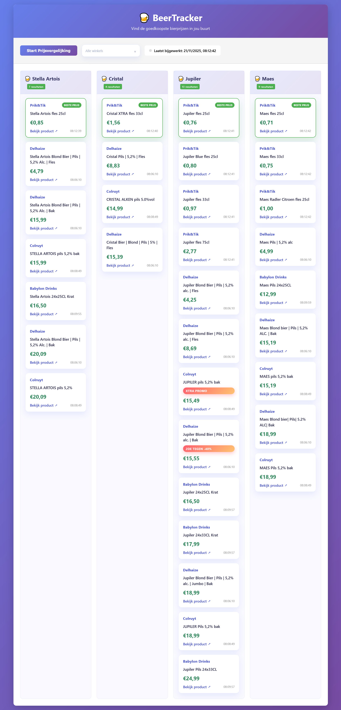
https://beertracker.onrender.com/

Desondanks dat het concept eenvoudig lijkt, bleek al snel dat die toch niet ZO simpel ging zijn. Dit komt, deels, doordat elke winkel een eigen DOM-structuur en laadstrategie heeft. Daardoor moest ik voor Delhaize, Colruyt, Carrefour, Babylon Drinks en Prik&Tik elk een aparte scraper-klasse ontwikkelen die overerft van een gedeelde BaseScraper. Om zo dus alle nodige informatie van de verschillende winkel webshops te kunnen halen.

Elke scraper gebruikt Playwright om een headless Chromium-browser te openen, verwijdert cookiebanners automatisch, scrolt tot alle producten geladen zijn, en extraheert naam, prijs, promoties en productlinks uit de DOM. Omdat webshops strikt zijn op botdetectie, implementeerde ik in de BaseScraper verschillende anti-botmaatregelen: aangepaste user-agents, navigator-spoofing, willekeurige muisbewegingen en variabele wachttijden om menselijk gedrag te simuleren.

Een voorbeeld hiervan is het manipuleren van browser-API's om automatisering te verbergen:

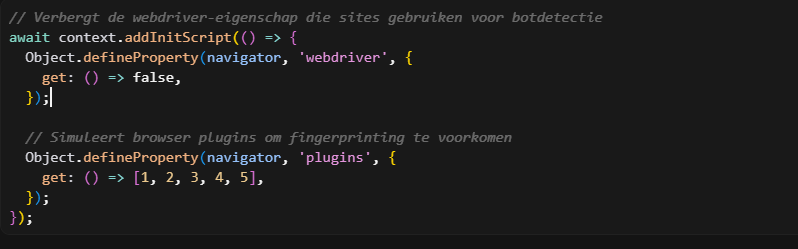

Daarnaast simuleert de scraper menselijke muisbewegingen met vloeiende patronen:

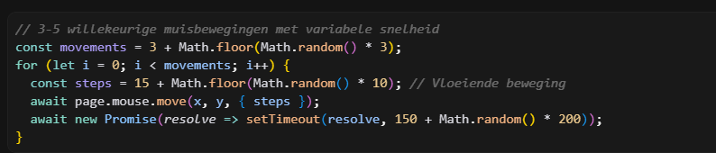

Terwijl alles redelijk goed, en snel, werkte wanneer ik het lokaal hosten, ontdekten ik snel tijdens het hosten op Render dat Delhaize zeer traag te laden door lazy-loading. Producten werden dynamisch geladen tijdens scrollen, waardoor de scraper vaak te vroeg stopte en niet alle producten kon oppikken. Ik loste dit op met een polling-mechanisme dat stapsgewijs scrollt en controleert of voldoende producten geladen zijn:

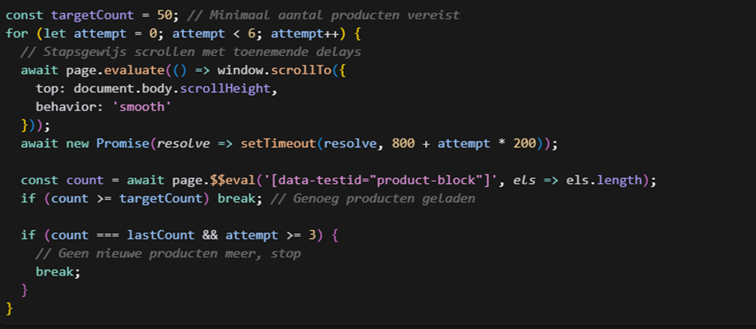

Door dit retry-mechanisme met exponentieel toenemende delays slaagde de scraper erin consistente resultaten te behalen, zelfs bij trage netwerkverbindingen.

Render's free tier bracht echter nog een ander probleem met zich mee: processen crashten regelmatig en tijdelijke bestanden gingen verloren bij restarts. Dit was jammer genoeg niet te vermijden, sinds de webscraping tool meer resources vereiste dan dat de gratis Render service kon bieden. Richting de toekomst toe zou dit vermeden kunnen worden door PDSS indien zij deze tool zelf integreren in hun hosting pakket/weghalen van render. Als tijdelijke oplossing stapte ik over van tijdelijk Json bestanden naar een PostgreSQL-database via Supabase, waarbij elke scrapingrun de oude gegevens overschrijft zodat altijd de meest recente data beschikbaar blijft:

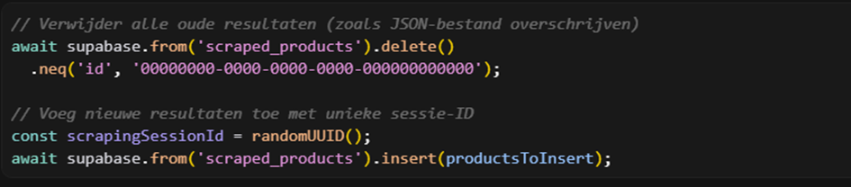

Dit garandeert dat de website altijd de laatste scrapingresultaten toont, ook na serverrestarts.

Omdat het scrapen per winkel tusen de 10 en 15 minuten kan duren en ik geen handmatige interventie wilde, implementeerde ik een Express API met WebSocket-ondersteuning voor real-time updates en een GitHub Action die dagelijks automatisch een scrapingrun start:

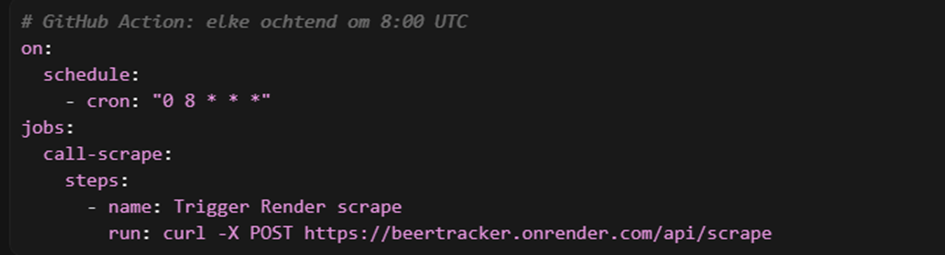

Tijdens het scrapen stuurt de server via WebSockets real-time updates naar verbonden clients, zodat gebruikers live kunnen volgen welke producten gevonden worden zonder de pagina te verversen. Hierdoor moeten mijn collega’s bij PDSS eigenlijk nooit zelf iets doen. Ze kunnen gewoon naar de webtool gaan, eventjes wachten tot de render server opstart, en kunnen kan de drank prijzen van de dag zien. Perfect voor als ze die dag inkopen gaan doen.

Voor hosting draait alles in een Docker-container gebaseerd op de officiële Playwright-image, waardoor lokaal en online exact dezelfde omgeving gebruikt wordt:

FROM mcr.microsoft.com/playwright:focal
RUN npx playwright install --with-deps chromium

Dit garandeert dat Chromium en alle system dependencies correct geïnstalleerd zijn, wat essentieel is voor stabiele browser-automatisatie.

Dankzij dit project heb ik veel ervaring opgedaan met browser-automatisatie, anti-botstrategieën, databasebeheer (PostgreSQL/Supabase), real-time communicatie (WebSockets), containerisatie (Docker), en het robuust hosten van scraping-systemen in productie-omgevingen. De kennis die ik hiermee verzameld heb is dan ook meteen gebruikt voor en eigen projectje waar ik in mijn vrije tijd aan zal werken. Een toffe bonus dus!

________________________________________

Parallel hieraan werkte ik aan een AI Mail Assistant, een Outlook-taskpane-add-in in TypeScript die e-mails kan samenvatten, de toon analyseren en complete antwoordvoorstellen genereert. Dit project ontstond uit klachten van collega's die veel tijd besteedden aan e-mails om frustraties met klanten of leveranciers professioneel over te brengen. Met deze tool hoop ik hun dagelijkse communicatie te versnellen.

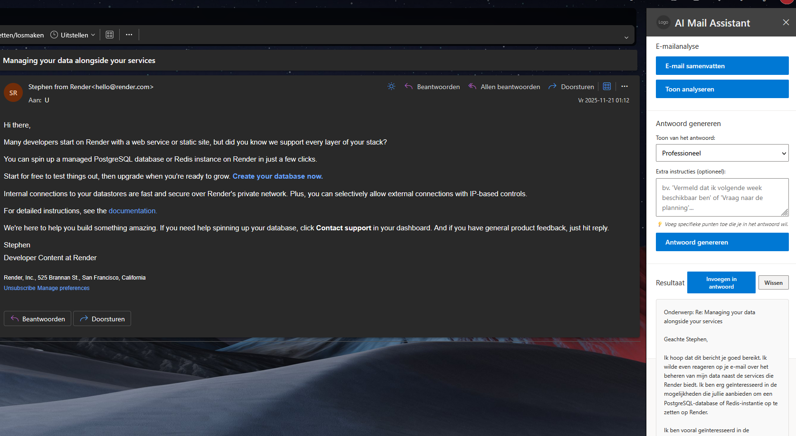

Ik heb de interface (HTML/CSS) en logica (taskpane.ts) gescheiden, zodat de Office.js-koppeling overzichtelijk blijft en de UI makkelijk uit te breiden is.

De kernuitdaging: betrouwbare AI-antwoorden.

Veel AI-modellen zijn duur, rate-limited, traag of raken overbelast. Daarom bouwde ik een multi-provider laag met Groq, Gemini, OpenAI en een mock-provider voor tests. Gebruikers kunnen kiezen welke provider ze gebruiken, en als er één uitvalt, kunnen ze overschakelen. Een centrale router (callAI) kiest op basis van de dropdown of een opgeslagen voorkeur de juiste provider. Dit houdt de code overzichtelijk: als een provider uitvalt, hoeft de UI niet te veranderen. 

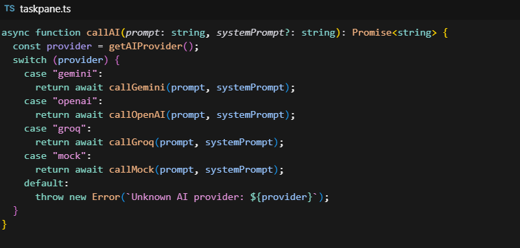

Voor Gemini en Groq heb ik retry-logica toegevoegd. Bij 503- of 429-fouten (overbelasting/rate limits) wordt automatisch opnieuw geprobeerd met exponentiële backoff. Ook controleer ik verschillende response-structuren, omdat providers soms andere JSON-formaten teruggeven. Hierdoor krijgen gebruikers meestal een antwoord, ook als een provider tijdelijk problemen heeft:

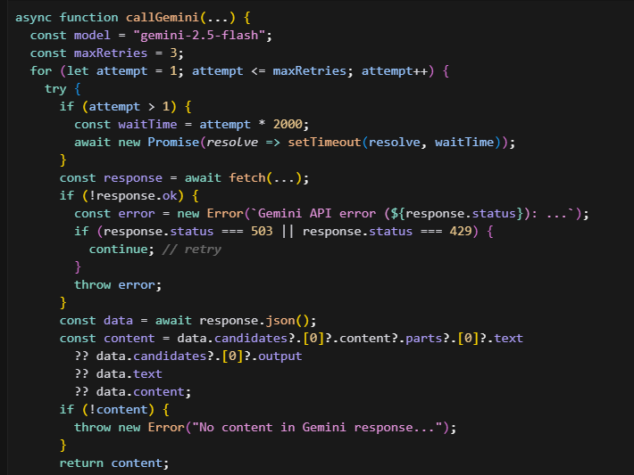
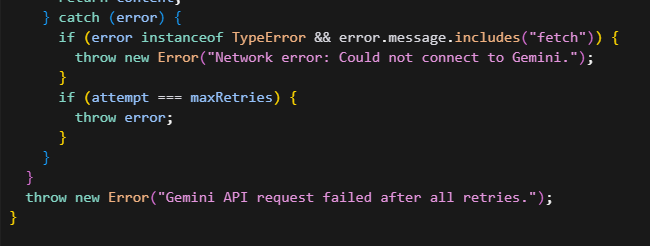

Outlook-integratie met Promises

Office.js gebruikt callbacks, wat de code complex maakt. Ik heb deze omgezet naar Promises met async/await, zodat functies als Emails samenvatten, Toon analyseren en antwoorden genereren de e-mailstructuur in één regel kunnen ophalen. Dit voorkomt race conditions en maakt de code testbaarder.

Deployment: Webpack + Vercel

Voor deployment gebruik ik Webpack om alles te bundelen. Webpack patcht automatisch de manifest-URL's voor productie (van localhost:3000 naar de Vercel-URL). Vercel biedt een CDN en automatische HTTPS, wat nodig is voor Outlook-add-ins. Na npm run build en vercel --prod staat de add-in online en kunnen collega's hem gebruiken zonder lokale server. Zo kan ik snel aanpassingen of updates maken zonder dat gebruikers iets merken of last van hebben.

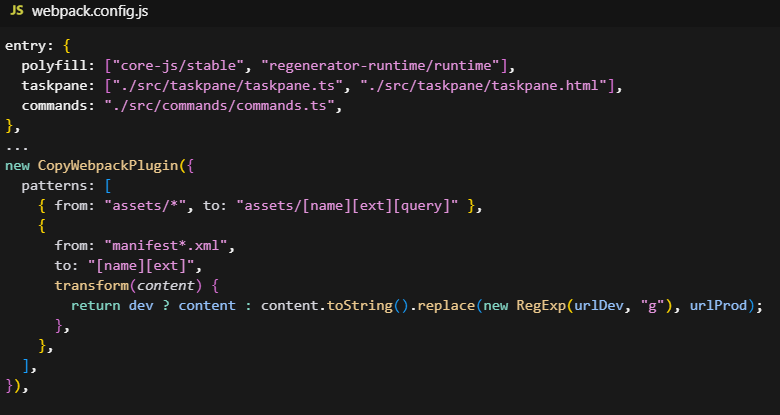

________________________________________
Conclusie:

Beide projecten samen vormden een uitdagende en leerrijke periode. Dankzij hulp en feedback van het PDSS-team kon ik de juiste technische beslissingen nemen en problemen efficiënt oplossen. Ik heb vooral geleerd om complexere systemen op te bouwen die automatisch blijven werken, zodat de eindgebruiker er zo min mogelijk omkijken naar heeft.

Zowel BeerTracker als de AI Mail Assistant hebben mij veel bijgebracht op het vlak van moderne webtechnologieën, AI-integraties, cloud hosting en software-automatisatie. Daarnaast heb ik ervaring opgedaan met het omgaan met web scraping-uitdagingen en het bouwen van robuuste API-integraties.

Naast mijn huidige projecten kreeg ik vanuit PDSS ook de kans om een mogelijk nieuw oefenproject te verkennen: een WordPress website voor Burney’s, een Family Entertainment. Voor dit project bestaat er al een volledig uitgewerkt design, Architectuur/Wireframes/prototype in figma. Het idee is niet dat ik de echte productie-website bouw, aangezien de scope net iets te groot is voor een stagiair, maar wel dat ik het bestaande ontwerp gebruik als oefening. In een testomgeving zou ik dan het volledige design vertalen naar een functionele WordPress-website, opgebouwd met Divi. Op die manier kan ik niet alleen mijn kennis van WordPress verder uitbouwen, maar ook leren hoe ik een professioneel design pixel-perfect kan omzetten naar een volwaardig digitaal product.

Dat is al een stapje verder richting de professionele kant, vergeleken met mijn eerdere wordpress projecten voor mijn klant(en). Minder prutsen en klungelen, meer professioneel tewerk gaan. Dit zal waarschijnlijk mijn laatste project worden voor het einde van de stage periode. Voorlopig heb ik hier enkel nog maar wat denk- en planwerk voor gedaan, maar ik hoop volgende week me hier volop voor in te zetten.
